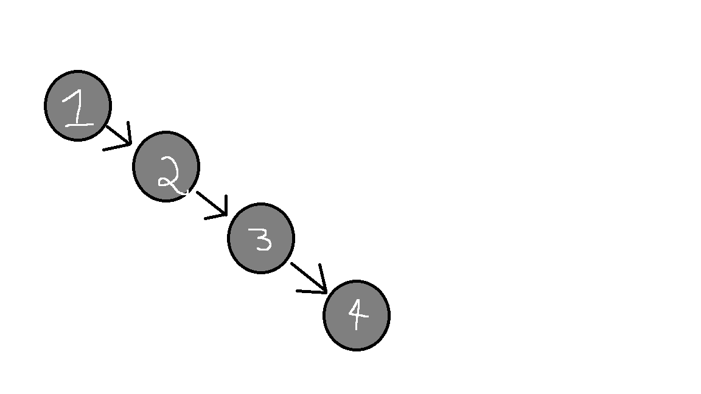

# Home Page

## Task

For my CS - 499 Computer Science Capstone, I am tasked with finding flaws/enhancing previous projects and creating fundamentally more sound deliverables for those projects. 

## My Project choices

The projects chosen for this ePortfolio are meant to encapsulate many skills I have learned as a student at SNHU and to further demonstrate
my ability to learn and grow as a developer. There were 3 previous projects that were all finals in courses taken at SNHU and I have further
enhanced their uses beyond the scope of each of their respective classes to enhance security, demonstrate best practices, utilitize appropriate
algorithms/data structures, and implement features while managing trade-offs

## Original Artifact 1 Flaws

Artifact 1 was originally used for IT - 145 Introduction to App Development. The original specification documents mentioned that having cats implemented into the system could be a possibility in the future. Due to the OOP nature of this project, these implementations will add to the complexity of the design. I also had noticed that the terminal menu could be confusing and the output was not often noticed as being the end of a branching path. Creating a more readable menu for the user while allowing the user to understand when a branching path had been concluded would also need to be a priority, for this enhancement, along with the inclusion of cat functionalities. 

Original Files on my GitHub: [Artifact One](https://github.com/CeruleanOwl/CeruleanOwl.github.io/tree/main/Originals/Artifact1)

## Original Artifact 2 Flaws

Artifact 2 was originally used for CS - 300 Data Structures and Algorithms: Analysis and Design. The original implementation was to create a binary search tree for ABCU Computer Science Department to display courses and their prerequisites. The major flaw with the designed binary search tree was that the input would need to be put in a specific order to maintain the O(logn) properties of the binary search tree. For example, if the data were to be input in sorted order, the binary search tree would have the same functionality as a linked list O(n):

Original Files on my GitHub: [Artifact Two](https://github.com/CeruleanOwl/CeruleanOwl.github.io/tree/main/Originals/Artifact2)

## Original Artifact 3 Flaws

place holder text