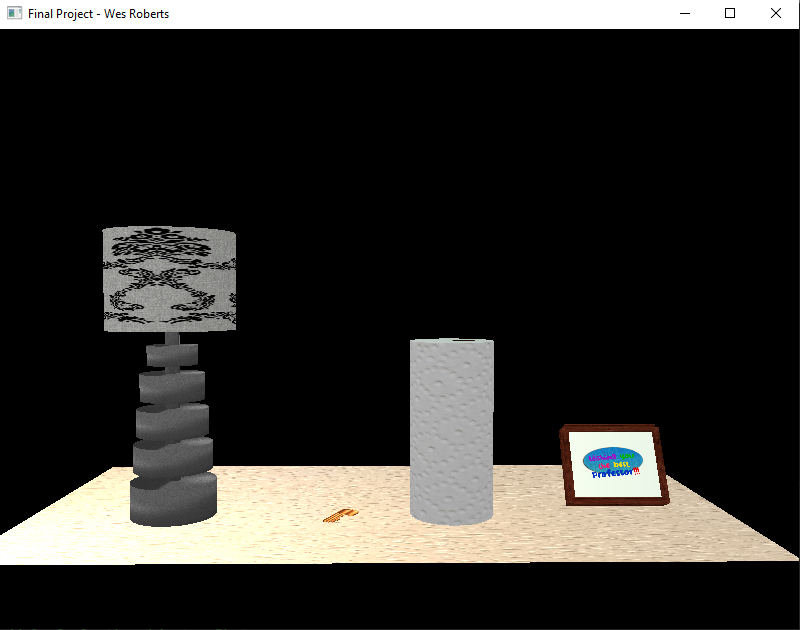
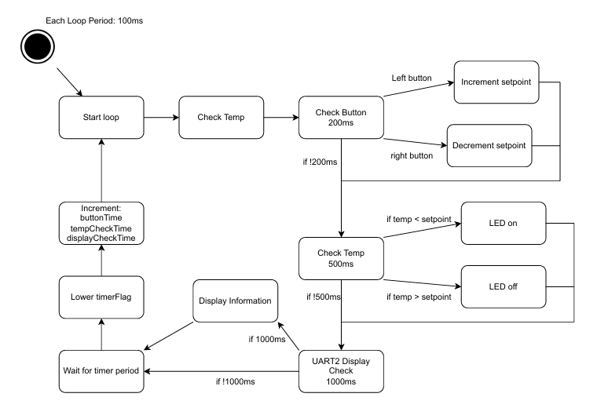
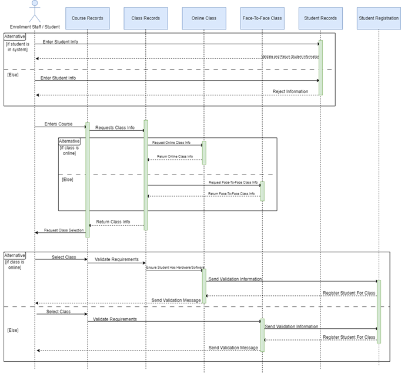
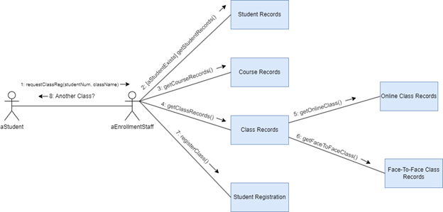

# Home Page

## Self Assessment

Hello World! My name is Wesley Roberts and I this is my CS - 499 Computer Science Capstone for SNHU. I am an aspiring software developer who has been refining my skills for years while working on my Bachelors in Computer Science. I enjoy learning about data structures and algorithms, but am eager to learn all their is about new systems, technologies, and get my hands on all sorts of software for me learn about. I strive to learn best practice in anything I do an have spent long hours, every day for years, keeping a high standard of practice in every aspect of my academic career and am excited to put that same level of energy into my professional career. I have managed to maintain a 4.0 over my years at SNHU and learned valuable skills that can transfer to any field within the computer science industry. A large variety of skills such as visual computation (CS - 330), embedded systems design (CS - 350), data structures and algorithms (CS - 300), and many more leading up to those skills aquired. I even aquired a strong eye for security through some choice electives throughout my courses such as Cyber security 200 and 230, being large staples for that mindset. 

## Skill Set Examples

There will be many of my skills showcased here in my ePortfolio, but I am going to start by addressing the wide variety I have aquired that took more time than others due to its difficulty level. Leading the charge is going to be graphics visual computation. I used OpenGL to create 3D meshes, add high definition textures, create shaders, navigate the 3D space, and did it all from scratch without any imported libraries. This exemplifies my ability to learn difficult C++ software while also keeping to a strict 8 week schedule and maintain results. I also collaborated with other struggling team members to help each other along on the learning process and answer each other's questions to effectively communicate new ideas for implementations throughout this course.

CS - 330 Showcase:

Original Files on my GitHub: [OpenGL Visual Computation Code](https://github.com/CeruleanOwl/CeruleanOwl.github.io/tree/main/ShowCaseItems/CS-330/OpenGLSample)

Another good example of my skills would be the embedded systems course that required me to design and develop a thermostat prototype using a CS3220S Texas Instrument board. I had to utilize C programming and embedded system design to create a functional thermostat prototype for SysTec. The final goal is to develop a thermostat that sends data to a SystTec server software over Wi-Fi and my prototype is meant to showcase the ability of the low-level thermostat functionality working.

CS - 350 Showcase Design:

Original Files on my GitHub: [Thermostat Prototype](https://github.com/CeruleanOwl/CeruleanOwl.github.io/tree/main/ShowCaseItems/CS-350)

Video Display of Thermostat Prototype working: [Thermostat Prototype Video](https://youtu.be/v7iijYhAtmo)

Fundamentally, I am able to create projects with precision and accuracy through my extensive practice of systems design principles I have learned throughout SNHU. Most projects aren't thought of on the spot and require meticulous planning before execution to ensure that everything runs smoothly for the operation. A fantastic showcase of my design implementations would be a Student Information System design I created and displayed using a Sequence diagram and a Communication Diagram to reflect behaviour of the expected system to further develop/design how the system is meant to handle user interactions.

Sequence Diagram:

Communication Diagram:

These skills have all led to my growth as a developer and I am ready to demonstrate those skills by enhancing previous projects and recognizing flaws in their original designs to unveil new solutions to the same issues.

## Task

For my CS - 499 Computer Science Capstone, I am tasked with finding flaws/enhancing previous projects and creating fundamentally more sound deliverables for those projects. 

## My Project choices

The projects chosen for this ePortfolio are meant to encapsulate many skills I have learned as a student at SNHU and to further demonstrate
my ability to learn and grow as a developer. There were 3 previous projects that were all finals in courses taken at SNHU and I have further
enhanced their uses beyond the scope of each of their respective classes to enhance security, demonstrate best practices, utilitize appropriate
algorithms/data structures, and implement features while managing trade-offs.

## Original Artifact 1 Flaws

Artifact 1 was originally used for IT - 145 Introduction to App Development. The original specification documents mentioned that having cats implemented into the system could be a possibility in the future. Due to the OOP nature of this project, these implementations will add to the complexity of the design. I also had noticed that the terminal menu could be confusing and the output was not often noticed as being the end of a branching path. Creating a more readable menu for the user while allowing the user to understand when a branching path had been concluded would also need to be a priority, for this enhancement, along with the inclusion of cat functionalities. 

Original Files on my GitHub: [Artifact One](https://github.com/CeruleanOwl/CeruleanOwl.github.io/tree/main/Originals/Artifact1)

## Original Artifact 2 Flaws

Artifact 2 was originally used for CS - 300 Data Structures and Algorithms: Analysis and Design. The original implementation was to create a binary search tree for ABCU Computer Science Department to display courses and their prerequisites. The major flaw with the designed binary search tree was that the input would need to be put in a specific order to maintain the O(logn) properties of the binary search tree. For example, if the data were to be input in sorted order, the binary search tree would have the same functionality as a linked list O(n):

Original Files on my GitHub: [Artifact Two](https://github.com/CeruleanOwl/CeruleanOwl.github.io/tree/main/Originals/Artifact2)

## Original Artifact 3 Flaws

Artifact 3 was originally used for CS - 340 Client-Server Side Application. The original artifact was created with older technology of nearly a decade, while also utilizing a Linux based VM for hosting the database and Jupyter Notebook project. The major flaw was using older technology for hosting the database without monitoring systems implemented to ensure proper resource management and activity logs for security purposes. 

Original Files on my GitHub: [Artifact Three](https://github.com/CeruleanOwl/CeruleanOwl.github.io/tree/main/Originals/Artifact3)