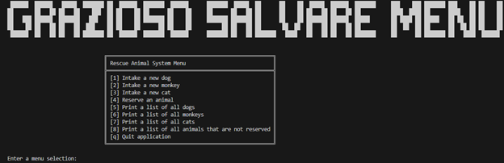

# Enhancement One

## Origin

This artifact was used in IT - 145 and was a terminal program for Grazioso Salvare. It was created back in April of 2021. The primary purpose of the artifact is to intake new animals, reserve animals, and allow a place for print options of those animals. 

## Inclusion and Course Objectives

The reason this artifact was included in my ePortfolio is to demonstrate an ability to use well-founded and innovative techniques, skills, and tools to deliver solutions for accomplishing industry-specific goals and support organizational decision making in the field of computer science. Many of these design choices were used to encapsulate these skills and showcase them with core OOP principles such as inheritance, complex design, polymorphism, abstractions, and encapsulation.

## Showcase

Welcome message and menu showcase:
