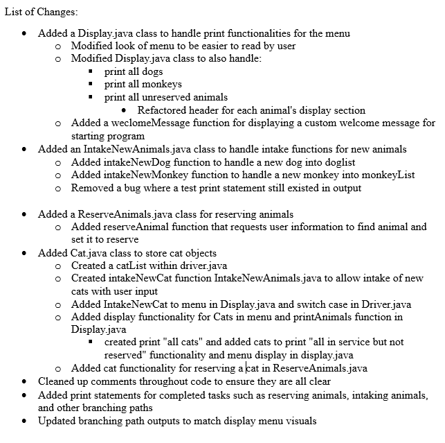

# Enhancement One

## Origin

As mentioned on the home page, this artifact was used in IT - 145 and was a terminal program for Grazioso Salvare. It was created back in April of 2021. The primary purpose of the artifact is to intake new animals, reserve animals, and allow a place for print options of those animals. 

## Inclusion and Course Objectives

The reason this artifact was included in my ePortfolio is to demonstrate an ability to use well-founded and innovative techniques, skills, and tools to deliver solutions for accomplishing industry-specific goals and support organizational decision-making in the field of computer science. Many of these design choices were used to encapsulate these skills and showcase them with core OOP principles such as inheritance, complex design, polymorphism, abstractions, and encapsulation.

## Showcase

Much of the original code resided inside the driver.java file and made managing much of the processes to be overly complicated. Much of a software developer's work needs to be complex, but there is no point in maintaining something overly complicated for no valuable reason. All of those processes were moved into their own functions to modularize the functionality and further encapsulate them inside their own classes. This made managing the tasks much easier and allowed for creating the cat.java functionality to be more intuitive on the iterative processes and allowed me to see which sections have been implemented much easier.

A large portion of confusion can come from a menu that doesn't easily explain required inputs. The menu was revamped to be more visually appealing for the user while also adding similar styling features to know that a branching path had been reached and the expected output would be displayed more clearly to ensure they receive the information they are looking for with ease.

Here is a showcase of the new menu design:

Enhancement Files on my GitHub: [Enhancement One](https://github.com/CeruleanOwl/CeruleanOwl.github.io/tree/main/Enhancements/EnhancementOne/Graz)