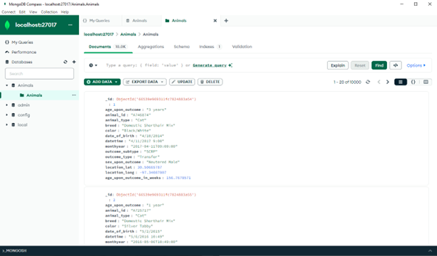
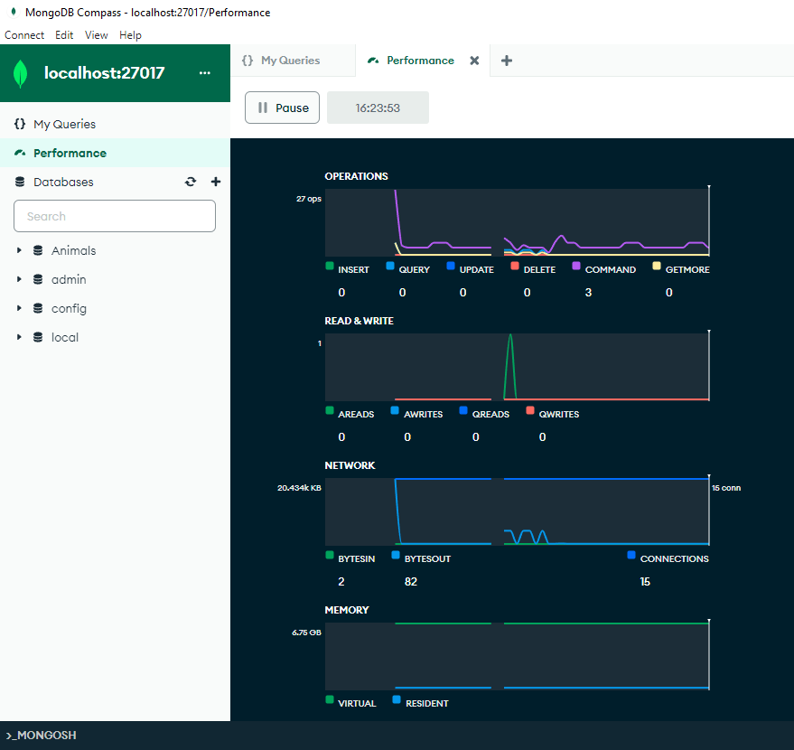
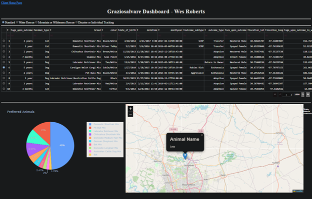
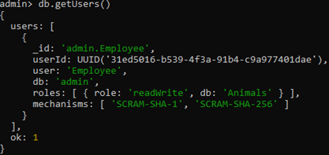

# Enhancement Three

## Origin

As mentioned on the home page, This artifact was used in CS - 340 and is a Jupyter Notebook project that utilizes the Dash framework for connecting to a MongoDB database and displaying an interactive data table about that data to the user in a Linux based environment.

## Inclusion and Course Objectives

The main purpose of this artifact to be included in my ePortfolio is to display a security mindset for data and resources and ensure security practices are well implemented. This will also require me to demonstrate coherent, technically sound, and appropriately adapted to fit my audience and contexts. 

## Showcase

The main enhancement is to change a Linux exclusively CLI based MongoDB and Jupyter Notebook project into a Windows based, up-to-date version, with new state of the art tools. The Mongo database was set up using MongoDB Compass, which is a GUI based platform to allow monitoring, managing, and setting up the data base. 

MongoDB Compass Database/Collection GUI:

MongoDB Compass Monitoring System:

MongoDB compass was also paired with MONGOSH for managing security of the system, which will be showcased later. MongoDB compass has monitoring capabilities for performance of the database, logs of it’s uses, and user tracking built into the GUI for easier to access user controls and pairs with MONGOSH for its security capabilities and groups/user creation.

The next step for the enhancement was connecting the Jupyter Notebook dashboard to the database, which require a list of dependencies to function:

* Dash
* Numpy
* Pandas
* Matplotlib
* Leaflet

Dashboard Display for Rescue Animals:

Next required me to set up user authentication and during those processes, I implemented the security practice of “least privilege” to only give functionality to the database for what is required to complete their tasks and nothing more. The “Employee” was given only read/write privileges to complete their given tasks of the database. 

Enhancement Files on my GitHub: [Enhancement Three](https://github.com/CeruleanOwl/CeruleanOwl.github.io/tree/main/Enhancements/EnhancementThree)