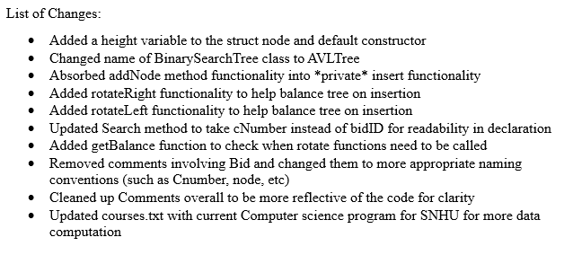
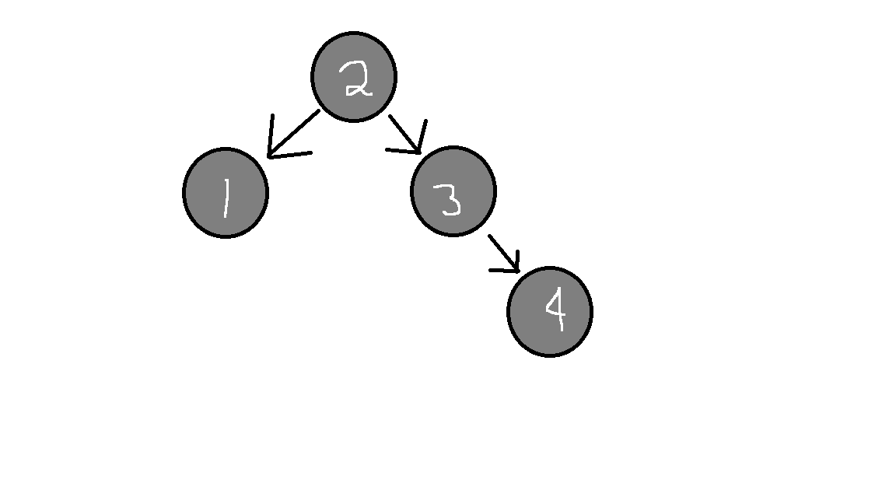

# Enhancement Two

## Origin

As mentioned on the home page, This artifact was used in CS - 300 and was a terminal program and a Course Scheduler for ABCU Computer Science Department. This program could read from a text file (formatted correctly) and take course numbers, course names, and then prerequisites and store them into objects to be inserted into a Binary Search Tree. 

## Inclusion and Course Objectives

The purpose of this artifact’s inclusion in my ePortfolio is to demonstrate an ability to use innovative techniques, skills, and tools to accomplish industry specific goals. It will also encapsulate the idea of managing trade-offs involved in design choices and developed using algorithmic principles and computer science best practices.

## Showcase

Due to the complexity of the changes, the list of changes won’t fully reflect on the purpose and overall changes of the code. The purpose of the changes is because the previous implementation required the user to input the information in a satisfactory order so that the tree will be balanced based on those inputs. This can be extremely difficult for the user to do with a larger set of data. The changes that took place were converting the tree into an AVL tree, which is a self-balancing tree structure to allow the input to be taken in any order and still maintain the expected O(logn) time complexity for searching up classes instead of O(n) in worst case scenarios of the previous implementation (Shown on home page).

Tree structure if given in sorted order:

The draw back of this structure is that inputting new information is slower than before, but searching up is going to commonly be faster. The reason for this implementation is because the user will be searching the information more than they would be adding new information, so this would overall speed up the use of this program for the user for a minor slow down on the insertion properties to keep the tree balanced. Overall, making the program more efficient for the user and keeping resources more readily available if used on a larger system.

Enhancement Files on my GitHub: [Enhancement Two](https://github.com/CeruleanOwl/CeruleanOwl.github.io/tree/main/Enhancements/EnhancementTwo)